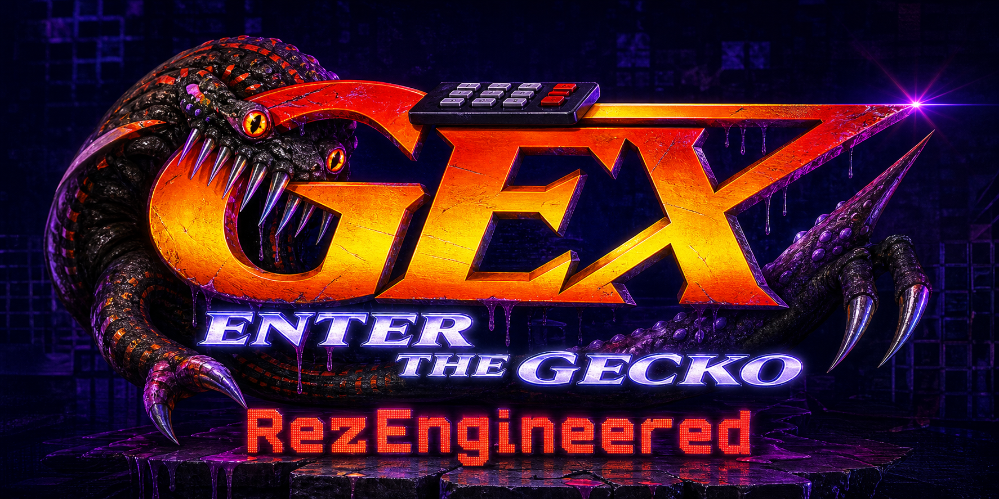
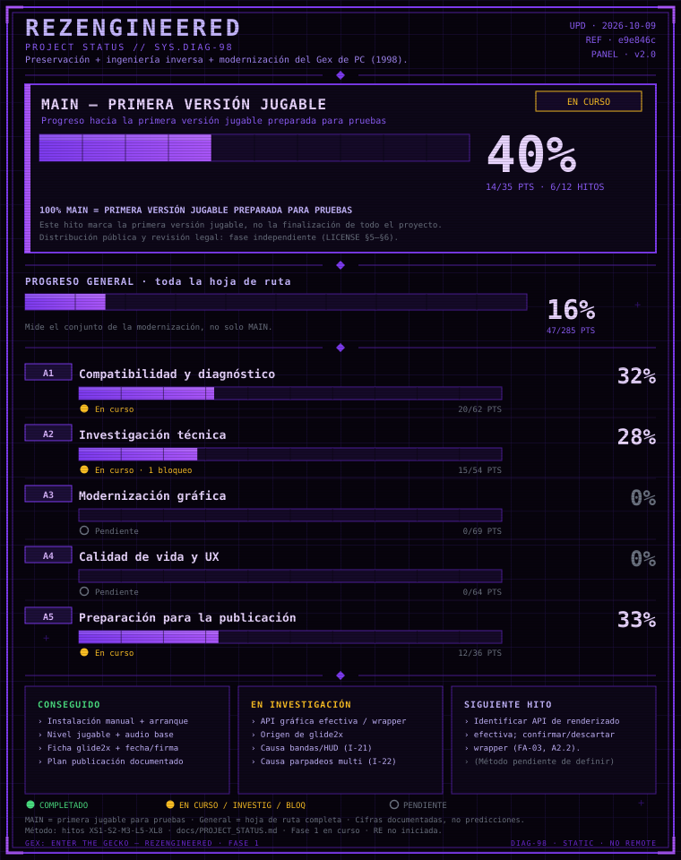

# Gex: Enter the Gecko — REZengineered

> **English summary:** *Gex: Enter the Gecko* — REZengineered is a
> reverse-engineering, preservation and modernization project for the
> original 1998 PC port.
> Goal: understand how the PC version really works, document every known issue
> and existing community fix with evidence, and only then implement native,
> well-understood fixes — without redistributing proprietary game files.
> Current phase: **1 — Research & Original PC Documentation**.
> Original artifacts inventoried; no game modifications yet.

## Objetivo

1. Comprender cómo funciona realmente la versión original de PC.
2. Analizar su ejecutable, arquitectura, sistemas y dependencias.
3. Investigar todos sus problemas conocidos.
4. Recopilar y analizar las soluciones, parches, wrappers, fixes y proyectos
   comunitarios existentes —y entender **por qué** funciona cada uno.
5. Localizar las causas reales dentro del juego mediante reverse engineering.
6. Desarrollar soluciones propias, priorizando fixes nativos sobre dependencias
   externas cuando sea técnicamente viable.
7. Modernizar el juego preservando su comportamiento y esencia originales.
8. Documentar absolutamente todo para que el proyecto sea reproducible y útil.

## Estado actual

| Campo               | Valor                                                        |
|---------------------|--------------------------------------------------------------|
| Fase                | **1 — Research & Original PC Documentation**                 |
| Versión             | 0.0.0                                                        |
| Artefactos originales | Inventariados (ver `docs/ORIGINAL_ARTIFACT_INVENTORY.md`)  |
| Reverse engineering | Profundo no iniciado (Etapa A documentada en Fase 1)         |
| Implementación      | **No iniciada (prohibida hasta completar la investigación)**  |
| Testing             | Hito 1 ejecutado (F-05 + arranque EU en Win11)              |

Ver [PROJECT_STATE.md](PROJECT_STATE.md) para el estado detallado.

### Panel de progreso



Metodología, evidencias y cifras: [docs/PROJECT_STATUS.md](docs/PROJECT_STATUS.md).

## Principio fundamental

> **Primero entendemos Gex. Después lo reingenierizamos.**

Cada cambio futuro deberá responder:

- ¿Qué problema estamos solucionando?
- ¿Dónde está causado?
- ¿Cómo sabemos que esa es la causa?
- ¿Qué soluciones ya existen?
- ¿Por qué elegimos esta solución?
- ¿Cómo sabemos que no hemos roto otra cosa?

Y todo se clasifica según el modelo de evidencia:
**Confirmado / Inferido / Experimental / Desconocido / Limitación**.
Nunca se presenta una hipótesis como un hecho confirmado.

Los objetivos futuros de modernización (todos propuestos, ninguno
implementado) están en [MODERNIZATION_GOALS.md](MODERNIZATION_GOALS.md).

## Jerarquía de referencias

1. **Fuente de verdad:** el *Gex: Enter the Gecko* original para PC.
2. **Referencias secundarias** (otras versiones: N64, guías PS1…): solo para
   distinguir comportamiento original de la familia Gex de problemas
   específicos del port PC. No reproducir otras versiones.
3. **Gex Trilogy no es referencia** del proyecto (solo contexto histórico).

## Documentación

| Documento                                              | Contenido                                    |
|--------------------------------------------------------|----------------------------------------------|
| [PROJECT_STATE.md](PROJECT_STATE.md)                   | Estado actual del proyecto                   |
| [ROADMAP.md](ROADMAP.md)                               | Fases y plan de trabajo                      |
| [CHANGELOG.md](CHANGELOG.md)                           | Historial de cambios                         |
| [RESEARCH.md](RESEARCH.md)                             | Fuentes y bibliografía anotada               |
| [KNOWN_ISSUES.md](KNOWN_ISSUES.md)                     | Mapa inicial de problemas conocidos          |
| [PATCH_ANALYSIS.md](PATCH_ANALYSIS.md)                 | Catálogo y análisis de fixes existentes      |
| [COMPATIBILITY.md](COMPATIBILITY.md)                   | Matriz de compatibilidad                     |
| [REVERSE_ENGINEERING.md](REVERSE_ENGINEERING.md)       | Plan y metodología de reverse engineering    |
| [docs/ORIGINAL_ARTIFACT_INVENTORY.md](docs/ORIGINAL_ARTIFACT_INVENTORY.md) | Inventario de artefactos originales (Fase 1) |
| [docs/REPO_SYNC_RULE.md](docs/REPO_SYNC_RULE.md)       | Regla permanente de sincronización global    |
| [docs/TOOLKIT.md](docs/TOOLKIT.md)                     | Entorno y herramientas disponibles           |
| [docs/PROJECT_STATUS.md](docs/PROJECT_STATUS.md)       | Metodología y registro del panel de progreso |
| [docs/ENGINEERING_LOG_TEMPLATE.md](docs/ENGINEERING_LOG_TEMPLATE.md) | Plantilla del registro de ingeniería |
| [BUILD.md](BUILD.md)                                   | Construcción (pendiente de definir)          |
| [TESTING.md](TESTING.md)                               | Metodología + protocolo + matriz FA + Hito 1 |
| [MODERNIZATION_GOALS.md](MODERNIZATION_GOALS.md)       | Objetivos futuros (todos PROPOSED)               |
| [CREDITS.md](CREDITS.md)                               | Créditos y agradecimientos                   |
| [LICENSE.md](LICENSE.md)                               | Licencia y política legal                    |

## Estructura del repositorio

```text
/
├── README.md / ROADMAP.md / CHANGELOG.md / ...  # Documentación del proyecto
├── docs/            # Guías (toolkit, plantillas, análisis futuros)
├── research/        # Notas de investigación (futuro)
├── tools/           # Herramientas propias (futuro)
└── scripts/         # Scripts propios (futuro)
```

El repositorio contiene **únicamente** código propio, herramientas propias,
documentación y material legalmente distribuible. Los archivos originales del
juego **nunca** se subirán aquí (ver [LICENSE.md](LICENSE.md)).

## Almacenamiento

- **GitHub** → proyecto y fuente de verdad (código, docs, herramientas).
- **Drive** → almacenamiento persistente (originales, backups, dumps, builds).
- **Workspace de Arena (~125 MB)** → trabajo temporal. No es almacenamiento.

## Cómo contribuir

De momento el proyecto está en fase de investigación: la mejor contribución es
información verificable (comportamientos observados, hashes, capturas, logs,
análisis de parches). Toda aportación debe indicar su nivel de evidencia.

---

*Proyecto de preservación sin afiliación con Crystal Dynamics, Eidos,
Square Enix, Midway, Ubisoft o Limited Run Games. Gex es marca de sus
respectivos propietarios.*
